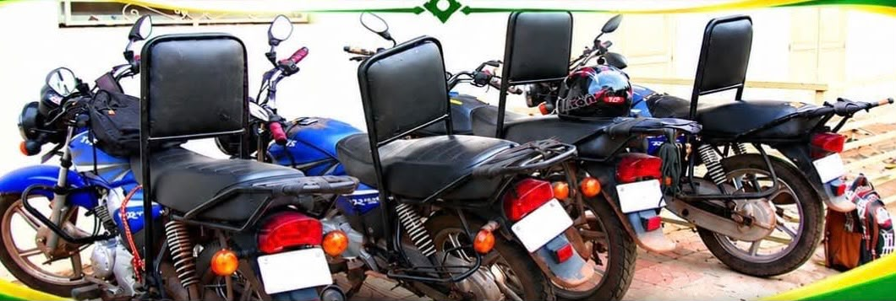

# La plateforme digitale de Bogna Ni Karama

**Présentation du projet · Moto Taxi à Bamako · Août 2026**

Préparé par **Lucman** — WhatsApp : +33 7 66 76 80 87

La plateforme est déjà construite. Vous pouvez l'ouvrir maintenant, depuis
votre téléphone :

**lucman223.github.io/bogna-ni-karama**

Présentation complète à faire défiler :
**lucman223.github.io/bogna-ni-karama/presentation.html**

---

## 1. Le point de départ

Le 8 août, vous lancez le service avec Sunna TV Savana. Les gens voient
l'affiche, ils sortent leur téléphone, ils cherchent votre nom.

Aujourd'hui, ils ne trouvent rien : ni site, ni liste de chauffeurs, ni moyen
de s'inscrire. Un client qui ne trouve pas votre numéro appelle un autre moto
taxi.

Ce que vous perdez chaque jour sans plateforme :

- Les clients qui cherchent en ligne et ne vous trouvent pas
- Les chauffeurs qui voudraient rejoindre votre flotte
- Votre plus grand atout, que personne ne connaît

## 2. Votre atout n'est pas le prix

*Chacun garde son espace, du départ à l'arrivée.*

**Toutes vos motos ont un dossier de séparation** installé derrière le
conducteur. Le passager s'appuie dessus au lieu de se tenir à lui : le trajet
se fait sans contact physique.

Beaucoup de personnes ne prenaient pas de moto taxi pour cette raison précise.
Avec vous, elles se déplacent librement.

Aucun concurrent ne peut copier cela du jour au lendemain : il faut équiper
chaque moto, une par une.

Le problème, c'est qu'une personne qui cherche ce service ne peut pas le
deviner en regardant une moto dans la rue. Elle doit demander, hésiter, parfois
renoncer. **La plateforme le dit à sa place, jour et nuit.**

## 3. Ce que la plateforme fait déjà

### Pour vos clients

- Ils trouvent un chauffeur près de chez eux, par quartier
- Ils voient son nom, sa moto, son immatriculation et son expérience
- Ils ont la garantie du dossier de séparation, sans avoir à demander
- Un bouton pour appeler, un autre pour WhatsApp

### Pour vos chauffeurs

- Ils s'inscrivent seuls, depuis leur téléphone, en deux minutes
- Si leur moto n'a pas de dossier, ils sont orientés vers votre atelier
  partenaire au lieu d'être refusés
- Leur fiche n'est publiée qu'après votre validation

### Pour vous

- Un tableau de bord : chauffeurs, validations en attente, motos en équipement
- Vous validez, refusez, suspendez ou réactivez chaque fiche d'un clic
- Vous exportez toute votre flotte vers Excel
- Vous gérez tout depuis votre téléphone

**La règle qui protège votre nom :** aucune moto ne circule sous le nom de
Bogna Ni Karama sans votre accord. Un chauffeur s'inscrit, sa fiche reste
invisible, vous vérifiez son identité, sa moto et son dossier, vous validez.

*Votre flotte : le dossier est installé avant la mise en service.*

## 4. Recruter sans perdre un seul chauffeur

Un chauffeur dont la moto n'a pas encore de dossier n'est pas refusé : la
plateforme l'oriente vers votre atelier partenaire, qui installe le dossier.
Une fois la moto équipée, vous validez sa fiche et il commence à travailler.

Vous suivez ces chauffeurs dans un onglet dédié, avec un bouton pour les
appeler. Chaque installation est un chauffeur de plus pour vous, et une moto de
plus équipée dans Bamako.

---

## 5. Les trois formules

Vous choisissez ce dont vous avez besoin aujourd'hui. On peut passer d'une
formule à la suivante plus tard : le travail déjà payé n'est jamais perdu.

### Formule Vitrine — être trouvé sur internet

**649 000 FCFA** (990 €) · 20 fiches saisies par nos soins

- Site web complet sur votre nom de domaine
- Page d'accueil avec le dossier de séparation mis en avant
- Annuaire de vos chauffeurs (photo, moto, quartier)
- Boutons appeler et WhatsApp sur chaque fiche
- Adapté au téléphone, chargement rapide
- Formation à la prise en main

À savoir : les chauffeurs ne s'inscrivent pas seuls, et chaque modification
passe par nous. Au-delà de 20 fiches à saisir, la formule Plateforme devient
plus avantageuse puisque les chauffeurs s'inscrivent eux-mêmes.

### Formule Plateforme — réserver en ligne et gérer votre flotte (recommandée)

**1 640 000 FCFA** (2 500 €) · Jusqu'à 150 chauffeurs

- Tout ce que contient la formule Vitrine
- **Réservation en ligne : le client commande sans appeler**
- Le chauffeur reçoit la demande et accepte ou refuse
- Base de données : les inscriptions vous arrivent vraiment
- Les chauffeurs s'inscrivent seuls depuis leur téléphone
- Panneau d'administration : valider, refuser, suspendre
- Suivi des motos en cours d'équipement
- Export Excel de toute votre flotte
- Comptes administrateurs sécurisés
- Photos des chauffeurs hébergées en ligne
- Formation complète à la gestion

À savoir : pas de statistiques détaillées ni d'espace chauffeur.

### Formule Complète — piloter avec des chiffres

**2 099 000 FCFA** (3 200 €) · Chauffeurs illimités

- Tout ce que contient la formule Plateforme
- Attribution automatique au chauffeur le plus proche
- Réservations programmées (départ à une heure précise)
- Historique des courses par chauffeur et par quartier
- Tableau de bord : courses, revenus, quartiers les plus actifs
- Notifications automatiques par WhatsApp
- Notes et avis des clients après la course
- Espace chauffeur : il suit ses courses et ses gains
- Formation approfondie à la gestion et aux chiffres

*Taux fixe : 1 € = 655,957 FCFA.*

## 6. Comparatif des formules

| Fonction | Vitrine | Plateforme | Complète |
|---|:---:|:---:|:---:|
| Site web et annuaire | Oui | Oui | Oui |
| Appel et WhatsApp en un clic | Oui | Oui | Oui |
| Formation à la livraison | Oui | Oui | Oui |
| Inscription des chauffeurs en ligne | — | Oui | Oui |
| Réservation en ligne | — | Oui | Oui |
| Panneau d'administration | — | Oui | Oui |
| Suivi des motos en équipement | — | Oui | Oui |
| Export Excel | — | Oui | Oui |
| Attribution automatique du chauffeur | — | — | Oui |
| Réservations programmées | — | — | Oui |
| Statistiques et revenus | — | — | Oui |
| Espace chauffeur | — | — | Oui |
| Notifications WhatsApp | — | — | Oui |
| Suivi du trajet en direct | — | — | En option |
| **Prix** | **649 000 FCFA** | **1 640 000 FCFA** | **2 099 000 FCFA** |

---

## 7. Ce que coûte une plateforme active

Ces frais **ne me reviennent pas** : ils vont aux services qui font tourner la
plateforme. Je vous les indique pour que vous sachiez exactement à quoi vous
engager.

| Formule | Ce qu'il faut payer | Total par an |
|---|---|---|
| Vitrine | Nom de domaine 10 000 FCFA · Hébergement gratuit | **10 000 FCFA** (15 €) |
| Plateforme | Nom de domaine 10 000 FCFA · Hébergement et base de données gratuits | **10 000 FCFA** (15 €) |
| Complète | Nom de domaine 10 000 FCFA · Base de données 197 000 FCFA · Messages WhatsApp 79 000 FCFA | **285 000 FCFA** (435 €) |

**Au démarrage, presque tout est gratuit.** Les formules Vitrine et Plateforme
tiennent dans les offres gratuites des services utilisés : seul le nom de
domaine est à payer. Les frais n'augmentent que le jour où votre activité
grandit, c'est-à-dire quand elle rapporte.

---

## 8. Option : le suivi du trajet en direct

**+ 918 000 FCFA** (1 400 €) · 3 à 4 semaines · réservé à la formule Complète

Le client voit la moto avancer sur une carte, comme sur les grandes applications
de transport. Il sait où est son chauffeur et dans combien de temps il arrive.
Un proche peut suivre le trajet depuis chez lui.

Ce que ça apporte :

- Position de la moto sur une carte, mise à jour en continu
- Temps d'arrivée estimé pour le client
- Lien de partage : un proche suit le trajet à distance
- Trajet enregistré : distance réelle et durée de chaque course
- Vous voyez sur une carte où sont toutes vos motos disponibles

**L'application installable est comprise dans ce prix.** Elle est indispensable :
un navigateur fermé n'envoie plus la position du chauffeur.

Ce qu'il faut savoir avant de choisir :

- Le chauffeur doit garder l'application ouverte pendant la course
- Cela consomme de la batterie et des données sur son téléphone
- La position se perd dans les zones sans réseau, puis se rattrape

### La carte : gratuite ou payante

| | Carte libre (OpenStreetMap) | Carte Google Maps |
|---|---|---|
| Coût | **Comprise, sans coût mensuel** | environ 20 000 FCFA (30 €) par mois |
| Couverture | Rues principales de Bamako bien couvertes | Cartographie plus complète et à jour |
| Itinéraires | Pas de calcul selon la circulation | Itinéraires selon la circulation |
| Limites | Certaines petites rues incomplètes | Carte bancaire à enregistrer chez Google |

Nous démarrons avec la carte libre : elle suffit largement pour voir la moto
approcher et estimer son arrivée. Si un jour vous voulez la précision de Google
Maps, le passage se fait sans refaire le travail.

### Pourquoi cette option coûte ce prix

Ce n'est pas « ajouter une carte ». Voici précisément ce qu'il y a à construire.

**1. Envoyer la position sans vider la batterie.** Le téléphone du chauffeur doit
envoyer sa position toutes les quelques secondes, pendant des heures, sans se
décharger. Il faut régler la fréquence, arrêter l'envoi quand la moto ne bouge
pas, et reprendre automatiquement. C'est ce réglage qui fait la différence entre
une application qu'on garde et une application qu'on désinstalle.

**2. Garder la connexion ouverte des deux côtés.** Le client et le chauffeur
doivent rester reliés pendant toute la course. Une page web normale demande des
informations puis se referme ; ici la liaison reste ouverte en permanence, dans
les deux sens. C'est une autre façon de construire, et c'est le cœur du travail.

**3. Tenir le coup quand le réseau tombe.** À Bamako, la connexion se coupe
régulièrement. Les positions doivent être gardées sur le téléphone puis
renvoyées quand le réseau revient, sans perdre le trajet ni afficher n'importe
quoi au client.

**4. Afficher une carte qui bouge, sur un téléphone modeste.** La moto doit
glisser sur la carte de façon fluide, même sur un téléphone d'entrée de gamme et
avec une connexion lente. Cela demande de lisser les positions reçues pour
éviter que l'icône saute.

**5. Tester en vrai, dans la circulation.** Ce genre de fonction ne se vérifie
pas sur un ordinateur : il faut sortir avec un téléphone, faire de vrais
trajets, traverser des zones sans réseau et corriger. C'est une part importante
des 3 à 4 semaines.

### Des services extérieurs, pas du bricolage

Une partie du travail repose sur des services spécialisés, les mêmes que ceux
utilisés par les grandes applications de transport. Je ne réinvente pas ce qui
existe déjà et fonctionne bien.

| Service | À quoi il sert | Coût |
|---|---|---|
| Le fond de carte | Les rues de Bamako affichées à l'écran | Gratuit avec la carte libre |
| Le service de position en temps réel | Transporter les positions du chauffeur vers le client, sans délai | Gratuit jusqu'à un usage important |
| Le GPS du téléphone | Mesurer la position réelle de la moto | Aucun |

**Pourquoi je le facture à part :** je préfère vous annoncer un prix séparé et le
faire correctement, plutôt que de l'inclure dans la formule et le bâcler. Un
suivi en direct qui saute, qui vide la batterie du chauffeur ou qui affiche la
moto au mauvais endroit vous fait plus de mal que pas de suivi du tout.

---

## 9. Faut-il une application mobile ?

Deux façons d'avoir une application. Elles n'ont ni le même prix, ni le même
délai, ni les mêmes contraintes.

### Application installable — recommandée pour démarrer

**+ 394 000 FCFA** (600 €) · 2 semaines

Le site s'installe sur le téléphone comme une application : icône sur l'écran
d'accueil, ouverture en plein écran, fonctionne même avec une connexion faible.
Rien à télécharger sur le Play Store.

- Aucun frais de boutique, ni Apple ni Google
- Installation en un clic depuis le site
- Mise à jour immédiate, sans que personne ne télécharge quoi que ce soit
- Fonctionne sur Android comme sur iPhone

À savoir : n'apparaît pas dans la recherche du Play Store, et les
notifications sont limitées sur iPhone.

### Application Play Store et App Store

**+ 2 296 000 FCFA** (3 500 €) · 2 à 3 mois

Une vraie application téléchargeable depuis les boutiques, développée
séparément du site. C'est un second produit à construire et à maintenir.

- Présence dans le Play Store et l'App Store
- Notifications complètes sur tous les téléphones
- Accès au GPS en continu (suivi du trajet en direct)

À savoir :

- Coût de développement 3 à 6 fois supérieur
- Chaque mise à jour doit être validée par Apple et Google
- Les clients doivent télécharger, puis mettre à jour
- Frais de boutique en plus : compte Google Play 15 000 FCFA une seule fois,
  compte Apple 60 000 FCFA **chaque année**

### Mon conseil

Commencez par le web. À Bamako, une personne qui a besoin d'une moto
maintenant n'installe pas une application de 40 Mo pour réserver : elle ouvre
un lien, elle appelle, elle part.

L'application installable donne l'expérience d'une application pour une
fraction du prix. Le Play Store aura du sens quand vos clients commanderont
chaque semaine.

Ce jour-là, la base de données sera déjà en place : l'application se branche
dessus. Rien de ce que vous payez aujourd'hui n'est perdu.

---

## 10. Formation et accompagnement

**La formation est comprise dans les trois formules.** Une plateforme que vous
ne savez pas utiliser ne sert à rien.

- **Prise en main** — on passe ensemble sur chaque écran, avec vos vrais
  chauffeurs et vos vraies données
- **Guide écrit en français** — un document simple, avec des captures d'écran
- **Un mois de questions** — vous m'écrivez sur WhatsApp, c'est compris

### Maintenance mensuelle, optionnelle

**32 000 FCFA** (49 €) par mois, sans engagement de durée :

- Vos modifications de textes, photos et quartiers
- Ajout ou retrait de fonctions simples
- Surveillance du site et corrections
- Sauvegarde régulière de vos données
- Assistance par WhatsApp en journée

Sans maintenance, la plateforme continue de fonctionner : vous la gérez
vous-même avec la formation reçue. La maintenance sert à ne plus y penser.

---

## 11. Calendrier

**Semaine 1** — Vos photos, vos textes, vos quartiers réels. Nom de domaine
réservé à votre nom. Coordonnées de l'atelier partenaire.

**Semaines 2 et 3** — Base de données et comptes administrateurs. Vos premiers
chauffeurs enregistrés. Essais depuis vos téléphones.

**Semaine 4** — Mise en ligne sur votre domaine. Formation à la gestion. Guide
écrit remis.

La démonstration est déjà faite. Si vous validez cette semaine, tout est en
ligne avant vos premières grosses journées.

---

## Pour finir

Vous ne vendez pas un trajet. Vous vendez un trajet **où chacun garde son
espace**.

La plateforme le raconte à votre place, jour et nuit, à chaque personne qui
cherche une moto à Bamako.

Écrivez-moi sur WhatsApp pour choisir la formule et démarrer.

**Lucman**

WhatsApp : +33 7 66 76 80 87
